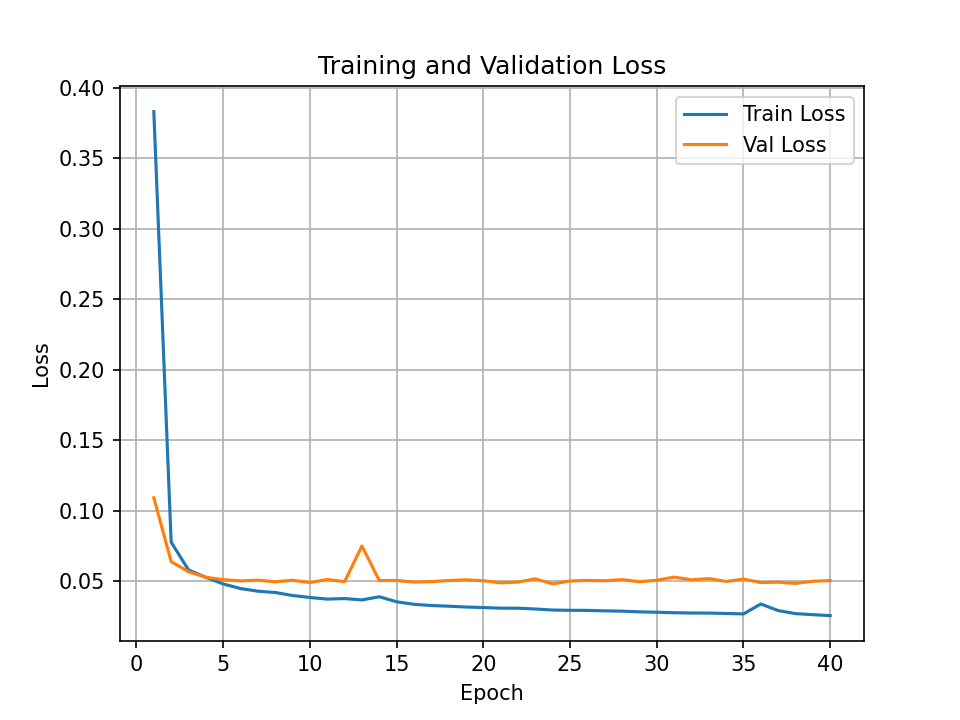
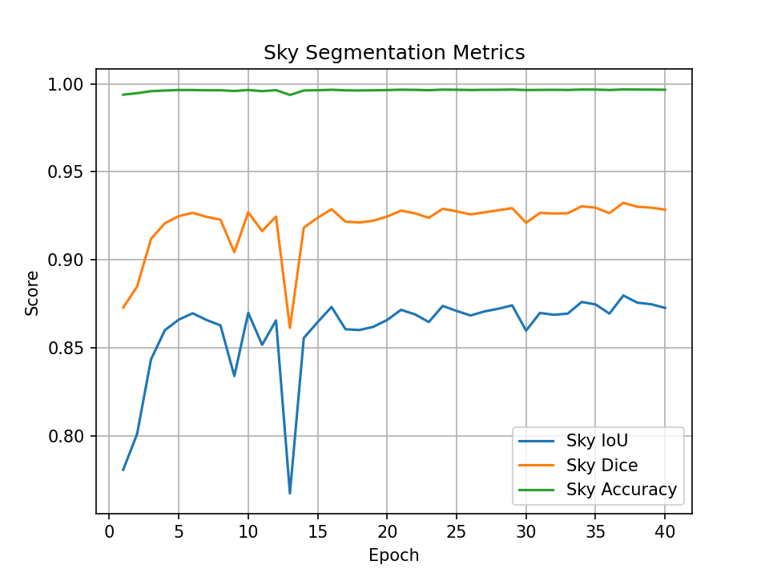
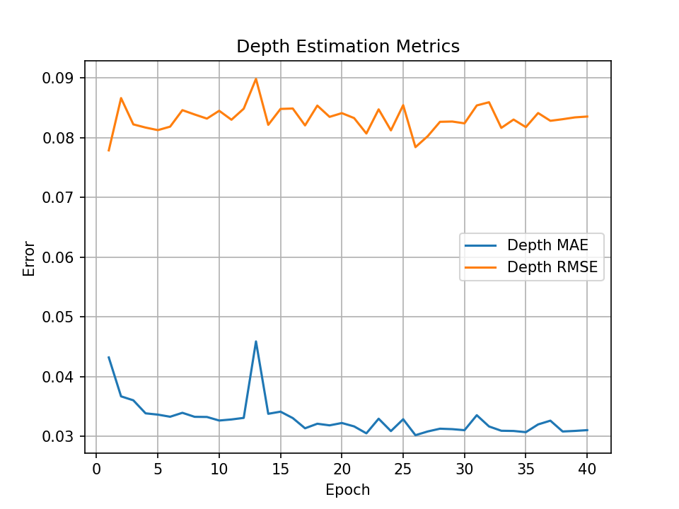
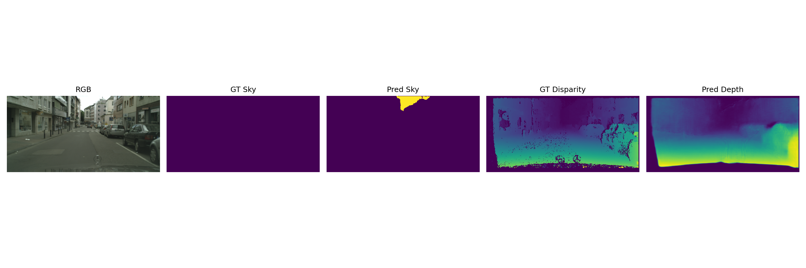

# Multi-Task Vision Network for Sky Segmentation and Depth Estimation

## Project Overview

This project implements a real-time multi-task deep learning pipeline capable of simultaneously:

* Segmenting the sky from a monocular RGB image.
* Estimating scene depth through disparity regression.

The complete workflow includes:

* Dataset preparation and preprocessing
* Multi-task neural network training in PyTorch
* ONNX export
* TensorRT optimization
* Real-time C++ inference using TensorRT and OpenCV
* Visualization of network predictions and inference performance

The objective was to design a complete training-to-deployment pipeline suitable for real-time computer vision applications.

---

# Repository Structure

```text
testStereo_Lab/
│
├── data/
│   └── cityscapes/
│       ├── leftImg8bit/
│       ├── gtFine/
│       └── disparity/
│
├── src/vision/
│   ├── datasets/
│   ├── models/
│   ├── training/
│   └── inference/
│
├──cpp_inference/
    ├── include/
    ├── src/
│       ├── main.cpp
│       ├── TensorRTModel.cpp
│       ├── Preprocessor.cpp
│       └── Postprocessor.cpp
└── CMakeLists.txt
│
├── models/
│   ├── multitask.onnx
│   └── multitask_fp16.engine
│
├── outputs/
│   ├── checkpoints/
│   └── predictions/
│
├── requirements.txt
└── README.md
```

---

# Dataset

The Cityscapes dataset was used for both training and evaluation.

## Input

* RGB monocular image

## Targets

### Sky Segmentation

A binary sky mask is generated from the Cityscapes semantic labels:

```text
Sky      → 1
Non-Sky  → 0
```

### Depth Estimation

Cityscapes disparity maps are used as depth supervision.

To stabilize training, disparity values are normalized to:

```text
[0,1]
```

while preserving the relative scene geometry.

## Training Resolution

```text
512 × 256
```

The original Cityscapes images are resized during preprocessing to reduce computational cost and accelerate experimentation.

---

# Model Architecture

A multi-task U-Net architecture is employed.

The encoder extracts shared visual features, while two dedicated prediction heads solve the individual tasks.

```text
RGB Image
    │
    ▼
ResNet34 Encoder
    │
    ▼
U-Net Decoder
    │
 ┌──┴─────────────┐
 │                │
 ▼                ▼
Sky Head      Depth Head
(2 classes)   (1 channel)
```

## Outputs

```text
Sky logits : [B, 2, H, W]
Depth map  : [B, 1, H, W]
```

---

# Technical Motivation

## Why Multi-Task Learning?

Sky segmentation and depth estimation are closely related tasks.

A shared encoder allows:

* Reduced computation
* Smaller memory footprint
* Faster inference
* Better feature reuse

while producing two outputs from a single forward pass.

## Why U-Net?

U-Net was selected because it:

* Is lightweight
* Trains quickly
* Preserves spatial information
* Produces accurate dense predictions

making it suitable for both segmentation and depth estimation.

## Why TensorRT?

TensorRT enables:

* FP16 optimization
* Layer fusion
* Reduced latency
* Higher throughput

which are essential for real-time deployment.

---

# Development Environment

## System Configuration

```text
Ubuntu 22.04
Python 3.10
CUDA 12.2
TensorRT 10.x
OpenCV 4.10
```

## Python Environment

Create and activate a virtual environment:

```bash
python3 -m venv vision
source vision/bin/activate
```

Install dependencies:

```bash
pip install -r requirements.txt
```

Install project package:

```bash
pip install -e .
```

---

# Training Pipeline

## Loss Function

The network is optimized using a weighted combination of segmentation and depth losses.

```text
Total Loss =
CrossEntropyLoss(Sky)
+
1.0 × L1Loss(Depth)
```

## Optimizer

```text
AdamW
Learning Rate = 1e-4
```

## Training Command

```bash
python -m vision.training.train \
    --epochs 40 \
    --batch-size 8 \
    --subset 1000
```

---

# Training Results

Training was run for 40 epochs. The best checkpoint was selected using the
lowest validation loss.

## Best Checkpoint Metrics

```text
Epoch: 24
```

| Metric | Value |
| --- | ---: |
| Train loss | 0.0296 |
| Validation loss | 0.0482 |
| Sky IoU | 0.8739 |
| Sky Dice | 0.9290 |
| Sky pixel accuracy | 0.9967 |
| Depth MAE | 0.0309 |
| Depth RMSE | 0.0812 |

Depth metrics are computed on valid disparity pixels after normalization to
`[0,1]`.

## Best Observed Validation Metrics

| Metric | Best value | Epoch |
| --- | ---: | ---: |
| Validation loss | 0.0482 | 24 |
| Sky IoU | 0.8798 | 37 |
| Sky Dice | 0.9324 | 37 |
| Sky pixel accuracy | 0.9968 | 37 |
| Depth MAE | 0.0302 | 26 |
| Depth RMSE | 0.0779 | 1 |

## Training Curves







Best model checkpoint:

```text
outputs/checkpoints/best_model.pth
```

Example predictions demonstrate that:

* The sky region is correctly localized.
* The depth branch captures the global scene geometry.
* Roads, vehicles, and buildings exhibit coherent depth ordering.



---

# ONNX Export

Export the trained PyTorch model:

```bash
python -m vision.training.export_onnx
```

Generated file:

```text
models/multitask.onnx
```

Model size:

```text
94 MB
```

---

# TensorRT Optimization

Generate an optimized TensorRT engine:

```bash
trtexec \
    --onnx=models/multitask.onnx \
    --saveEngine=models/multitask_fp16.engine \
    --fp16
```

Generated engine:

```text
models/multitask_fp16.engine
```

Engine size:

```text
50 MB
```

---

# Runtime Performance

## Hardware

```text
NVIDIA RTX 1000 Ada Laptop GPU
CUDA 12.2
TensorRT FP16
```

## TensorRT Benchmark

```text
Mean Latency : 2.16 ms
GPU Compute  : 1.86 ms
Throughput   : 536 FPS
```

The TensorRT deployment achieves real-time performance with substantial acceleration compared to the original PyTorch model.

---

# C++ Inference Application

The deployment application is implemented entirely in C++.

File:

```text
cpp_inference/src/main.cpp
```

## Features

* ONNX model loading through the TensorRT ONNX parser
* Optional TensorRT engine loading for faster startup
* CUDA-based inference
* Image preprocessing
* Sky mask generation
* Depth map generation
* OpenCV visualization
* Runtime measurement

## Build

```bash
./build_inference.sh

or 

cd cpp_inference

mkdir -p build
cd build

cmake ..
make -j
```

## Run

```bash
./cpp_inference/bin/multitask_infer \
    models/multitask.onnx \
    test_data/mainz.png
```

```bash
./cpp_inference/bin/multitask_infer \
    models/multitask.onnx \
    test_data/o1.mp4 \
    result.mp4
```

For faster startup after optimization, the same executable also accepts the
serialized TensorRT engine:

```bash
./cpp_inference/bin/multitask_infer \
    models/multitask_fp16.engine \
    test_data/o1.mp4 \
    result.mp4
```

Note: video input uses frame-step manipulation to keep playback smooth during
real-time visualization. The default video frame step is `30`, and it can be
changed at runtime with the `+` and `-` keys.

---

# Visualization

The application displays:

```text
Original RGB Image
Sky Segmentation Overlay
Depth Map
Inference Time (ms)
```

allowing direct qualitative evaluation of the model predictions.

Example output video:

[result.mp4](result.mp4)

<video src="result.mp4" controls>
  Your browser does not support the video tag.
</video>

---

# Dependencies

## Python

* PyTorch
* TorchVision
* Segmentation Models PyTorch
* TIMM
* NumPy
* Pillow
* Matplotlib
* ONNX
* ONNX Runtime GPU

## C++

* CUDA 12.x
* TensorRT 10.x
* OpenCV 4.x
* GCC 11+
* CMake

---

# Future Improvements

Potential extensions include:

* Transformer-based encoder backbones
* Knowledge distillation for smaller models
* INT8 TensorRT optimization
* Temporal smoothing for video streams
* Joint depth and semantic consistency losses

---

# License

Cityscapes data is distributed under the Cityscapes dataset license.

Please refer to the original dataset license before redistribution or commercial use.
